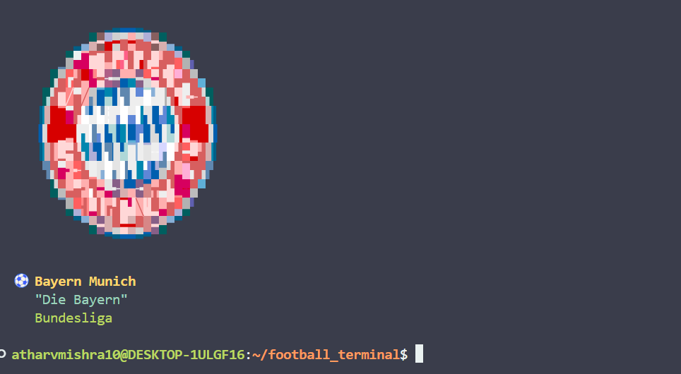

# Football Clubs Terminal

A command-line tool that displays football club logos and information directly in your terminal using ASCII art.

## DEMO



## Features

- Display random football club logos in terminal
- Show specific club information by name
- List all available clubs
- Colorized terminal output
- Shell integration for startup display

## Prerequisites

- **Nim compiler** - Install from [nim-lang.org](https://nim-lang.org/install.html)
- **chafa** - For image-to-ASCII conversion
  - Ubuntu/Debian: `sudo apt install chafa`
  - macOS: `brew install chafa`
  - Arch Linux: `sudo pacman -S chafa`

## Installation

### Automatic Installation

```bash
chmod +x install.sh
./install.sh
```

The installer will:
1. Compile the Nim source code
2. Install the binary to `/usr/local/bin` or `~/.local/bin`
3. Set up logo directory structure
4. Optionally configure shell integration

### Manual Installation

```bash
# Compile the binary
nim c -d:release --out:football-clubs football_clubs.nim

# Move to PATH
sudo cp football-clubs /usr/local/bin/
# or for user installation
mkdir -p ~/.local/bin && cp football-clubs ~/.local/bin/

# Create logo directory
sudo mkdir -p /usr/local/share/football-clubs/logos
# or for user installation
mkdir -p ~/.local/share/football-clubs/logos
```

## Logo Setup

Place PNG logo files in the logos directory:

**System installation:**
```
/usr/local/share/football-clubs/logos/
```

**User installation:**
```
~/.local/share/football-clubs/logos/
```

Required logo files:
- `barcelona.png`
- `real_madrid.png`
- `manchester_united.png`
- `liverpool.png`
- `bayern_munich.png`
- `juventus.png`

## Usage

### Basic Commands

```bash
# Show random club
football-clubs

# Show specific club
football-clubs barcelona
football-clubs "real madrid"
football-clubs manchester_united

# List available clubs
football-clubs list

# Show help
football-clubs help
```

### Shell Integration

Add to your shell configuration file to show a random club on terminal startup:

**Bash (~/.bashrc):**
```bash
football-clubs
```

**Zsh (~/.zshrc):**
```bash
football-clubs
```

**Fish (~/.config/fish/config.fish):**
```bash
football-clubs
```

## Supported Clubs

| Club | Nickname | League |
|------|----------|--------|
| FC Barcelona | Barça | La Liga |
| Real Madrid | Los Blancos | La Liga |
| Manchester United | Red Devils | Premier League |
| Liverpool FC | The Reds | Premier League |
| Bayern Munich | Die Bayern | Bundesliga |
| Juventus | Juve | Serie A |

## File Structure

```
football-clubs/
├── football_clubs.nim      # Main source code
├── install.sh              # Installation script
├── logos/                  # Logo PNG files
│   ├── barcelona.png
│   ├── real_madrid.png
│   ├── manchester_united.png
│   ├── liverpool.png
│   ├── bayern_munich.png
│   └── juventus.png
└── README.md
```

## Development

### Building from Source

```bash
nim c -d:release football_clubs.nim
```

### Debug Mode

```bash
nim c -d:debug -d:debug football_clubs.nim
```

### Adding New Clubs

1. Add club information to the `clubs` table in `football_clubs.nim`
2. Add corresponding PNG logo file to the logos directory
3. Recompile the binary

## Uninstallation

```bash
./install.sh uninstall
```

Or manually remove:
```bash
sudo rm /usr/local/bin/football-clubs
sudo rm -rf /usr/local/share/football-clubs
# Remove from shell config file
```

## Troubleshooting

### No logos showing
- Verify chafa is installed: `chafa --version`
- Check logo directory exists and contains PNG files
- Run with debug: `nim c -d:debug football_clubs.nim`

### Binary not found
- Ensure `/usr/local/bin` or `~/.local/bin` is in your PATH
- Check binary permissions: `ls -la /usr/local/bin/football-clubs`

### Logo directory not found
- The tool automatically checks both system and user directories
- Manually create directory and add logo files as described above

## License

This project is open source and available under standard software licenses.

